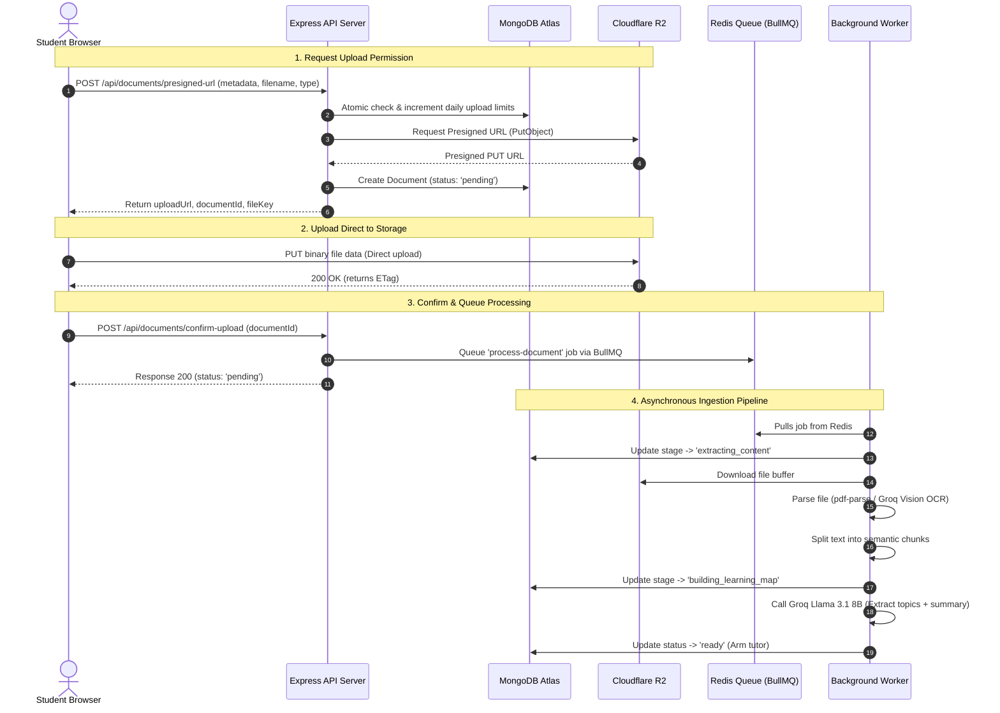

# BRAUDLE Document Ingestion & Direct R2 Upload Architecture

This document details the system architecture and technical flows for the document upload and background processing system in the BRAUDLE backend. 

---

## 1. Architectural Overview

To deliver high-speed, scalable uploads with zero backend bottlenecks, BRAUDLE uses a **Direct-to-Storage Architecture**. Rather than routing heavy file uploads through the Express application server, files are uploaded directly from the student's browser to **Cloudflare R2 Object Storage** using **S3-compatible presigned URLs**. 

The system supports two ingestion pathways depending on file size:
1. **Direct Single Upload (PUT)**: Best for standard documents/images (<10MB).
2. **Direct Multipart Upload**: Recommended for large PDFs (>10MB). Files are split into chunks (5MB-10MB) on the frontend, uploaded in parallel directly to R2, and merged.



---

## 2. Ingestion Lifecycles & API Contracts

### 2.1 Single File Direct Upload Flow
For smaller files (< 10MB), the single-file presigned PUT flow provides the lowest overhead:

1. **Authorization & Rate Limit Check**:
   - The client calls `POST /api/documents/presigned-url` passing the document metadata (`title`, `subject`, `filename`, `contentType`).
   - The backend checks limits atomically on the `User` model to prevent TOCTOU (Time of Check to Time of Use) race conditions.
2. **Document Pre-Registration**:
   - An R2 object key is generated: `uploads/${userId}/${Date.now()}-${sanitizedName}`.
   - The backend requests a presigned PUT URL from R2 using `PutObjectCommand` expiring in 15 minutes.
   - A `Document` record is created in MongoDB with status `pending`.
   - The backend returns `{ documentId, uploadUrl, fileKey, fileUrl }`.
3. **Storage Transfer**:
   - The browser performs a direct `PUT` request to `uploadUrl` sending the file binary.
4. **Trigger Processing**:
   - The browser calls `POST /api/documents/confirm-upload` with `{ documentId }`.
   - The backend pushes a job onto the BullMQ Redis queue.

---

### 2.2 Multipart (Chunked) Parallel Upload Flow
For large PDFs, multipart uploads bypass browser timeouts and utilize parallel bandwidth:

1. **Session Initiation**:
   - Client calls `POST /api/documents/multipart/initiate`.
   - Backend validates rate limits, starts a multipart upload session in R2 using `CreateMultipartUploadCommand`, pre-registers the MongoDB document, and returns `{ documentId, uploadId, fileKey }`.
2. **Chunk Generation & Presigning**:
   - Browser splits the PDF into chunks (minimum 5MB).
   - Client requests upload URLs for all chunk numbers: `POST /api/documents/multipart/presign-parts` with `{ uploadId, fileKey, partNumbers: [1, 2, ...] }`.
   - Backend returns a mapping of part numbers to custom presigned URLs.
3. **Parallel Storage Transfer**:
   - Browser uploads all chunks concurrently to their respective URLs. It captures the returned `ETag` header for each chunk.
4. **Assembly & Ingestion**:
   - Browser calls `POST /api/documents/multipart/complete` passing the list of parts: `parts: [{ PartNumber: 1, ETag: "..." }, ...]`.
   - Backend calls `CompleteMultipartUploadCommand` to make R2 merge the chunks into a single file.
   - Once completed, the backend queues the job in BullMQ.
5. **Abort Clean-up (Fallback)**:
   - If chunk uploads fail, the browser calls `POST /api/documents/multipart/abort`.
   - The backend invokes `AbortMultipartUploadCommand` on R2 to purge temporary chunks, deletes the MongoDB document, and decrements the user's rate limits.

---

## 3. Background Processing Pipeline

Once a job is queued in Redis, the BullMQ Worker (`src/workers/document.worker.js`) executes the ingestion pipeline. As it runs, it updates the `processingStage` field in MongoDB so the client can display real-time progress.

```
[pending] 
   │
   ▼
[file_received] ---------> [extracting_content] ---------> [identifying_concepts]
                              (R2 Download +                (Semantic Chunker)
                              pdf-parse/Groq OCR)                  │
                                                                   ▼
[ready] <----------------- [preparing_tutor] <----------- [building_learning_map]
(Tutor armed)             (MongoDB Sync)                 (Groq Topic & Summary)
```

### Ingestion Stages:
1. **`file_received`**: Worker pulls the job from Redis and begins processing.
2. **`extracting_content`**: Worker downloads the buffer from R2:
   - **PDF**: Text is extracted locally using `pdf-parse` (0 cost, highly optimized).
   - **Images (PNG, JPEG, WEBP)**: Sent to **Groq Vision** (Qwen 2.5 72B / Llama 3.2 11B Vision) for OCR/transcription.
3. **`identifying_concepts`**: Extracted text is split into semantic teaching chunks (sliding window chunker).
4. **`building_learning_map`**: Chunks are processed by **Llama 3.1 8B** via Groq to extract:
   - Key topics discussed.
   - A friendly student-facing summary.
5. **`preparing_tutor`**: Topics, summary, raw text, and chunks are saved to MongoDB.
6. **`ready`**: Document status is updated to `ready`. The student is now able to start study sessions.

---

## 4. Failure Recovery & Resiliency

- **Rate Limit Rollback**: If the upload is aborted or fails before completion, the user's daily limit counter is decremented.
- **Worker Auto-Retry**: BullMQ is configured to retry processing jobs up to 3 times with exponential backoff on transient errors (e.g. database locks or temporary API timeouts).
- **Graceful degradation**: If Groq fails to generate the summary or topics during Stage 4, the document is still marked `ready` with `aiUnderstandingFailed: true`. The student can still use the interactive chat tutor normally.
